# CMD Casino

Een full-stack multiplayer casinoplatform gebouwd als schoolproject voor de opleiding Communication and Multimedia Design. Spelers kunnen meerdere casinospellen spelen, EC-punten verdienen en echte betalingen doen.

---

## Spellen

| Spel | Modus | Omschrijving |
|------|-------|-------------|
| Blackjack | Solo | Speel tegen de dealer |
| Blackjack | Multiplayer | Tot 4 spelers in een kamer via WebSockets |
| Roulette | Solo | Gooi de bal, wed op nummers en kleuren |
| Mines | Solo | Onthul veilige tegels zonder een mijn te raken |
| Poker | Multiplayer | Texas Hold'em met meerdere spelers in een kamer |

---

## Tech Stack

| Onderdeel | Technologie | Documentatie |
|-----------|------------|--------------|
| Framework | [Astro](https://astro.build) (SSR mode) | https://docs.astro.build |
| Server | Node.js + eigen HTTP-server | https://nodejs.org/docs |
| Database | [MongoDB](https://www.mongodb.com) + officiële driver | https://www.mongodb.com/docs/drivers/node |
| Realtime | [ws](https://github.com/websockets/ws) (WebSocket library) | https://github.com/websockets/ws |
| Betalingen | [Mollie API](https://docs.mollie.com) | https://docs.mollie.com |
| Authenticatie | [jsonwebtoken](https://github.com/auth0/node-jsonwebtoken) + [bcrypt](https://github.com/kelektiv/node.bcrypt.js) | — |
| Content API | [Wikipedia Action API](https://www.mediawiki.org/wiki/API:Main_page) | https://www.mediawiki.org/wiki/API:Query |
| Geluid / Stem | [ElevenLabs TTS API](https://elevenlabs.io/docs) | https://elevenlabs.io/docs |
| Hosting | [Render](https://render.com) | https://render.com/docs |

---

## Vereisten

- Node.js >= 22.12.0
- MongoDB instantie (lokaal of Atlas)
- Mollie API-sleutel (voor betalingen)
- ElevenLabs API-sleutel (voor dealergeluid)

---

## Installatie

```bash
npm install
cp .env.example .env   # Vul je eigen waarden in
npm run dev            # Development op localhost:4321
npm start              # Productie (vereist eerst: npm run build)
```

---

## Omgevingsvariabelen

```env
MONGODB_URI=mongodb://localhost:27017/blackjack
JWT_SECRET=jouw_geheime_sleutel
MOLLIE_API_KEY=test_xxxxxxxxxxxxxxxxxxxxxxxxxxxxxxxx
ELEVENLABS_API_KEY=jouw_sleutel
```

---

## Projectstructuur

```
/
├── server.mjs                  # Productie-entrypoint: HTTP-server + WebSocket
├── astro.config.mjs            # Astro-configuratie (SSR via Node.js adapter)
│
├── server/                     # Server-side logica (draait alleen op de server)
│   ├── websocket.js            # WebSocket-server, berichtenafhandeling
│   ├── gameManager.js          # Blackjack spellogica voor multiplayer
│   ├── pokerManager.js         # Texas Hold'em spellogica en handevaluatie
│   ├── minesState.js           # Sessiebeheer en multiplier-berekening voor Mines
│   ├── db.js                   # Helperfuncties voor coins en scores (MongoDB)
│   └── mongodb.js              # MongoDB-verbinding opzetten
│
├── lib/                        # Gedeelde logica voor server én API-routes
│   └── auth.js                 # JWT aanmaken, verifiëren en token uit request halen
│
├── src/
│   ├── pages/                  # Elke .astro file is een pagina
│   │   ├── index.astro         # Lobby / startpagina met spelkeuze
│   │   ├── blackjack.astro     # Solo Blackjack
│   │   ├── multiplayer.astro   # Multiplayer Blackjack
│   │   ├── roulette.astro      # Roulette
│   │   ├── mines.astro         # Mines
│   │   ├── poker.astro         # Multiplayer Poker
│   │   ├── rules.astro         # Spelregels (via Wikipedia API)
│   │   ├── account.astro       # Accountoverzicht
│   │   ├── shop.astro          # Coins kopen via Mollie
│   │   ├── leaderboard.astro   # Ranglijst
│   │   ├── login.astro         # Inloggen
│   │   ├── signup.astro        # Registreren
│   │   └── api/                # API-endpoints (server-side functies)
│   │       ├── login.js        # POST: inloggen, JWT teruggeven
│   │       ├── signup.js       # POST: account aanmaken
│   │       ├── me.js           # GET: ingelogde gebruiker ophalen
│   │       ├── balance.json.js # GET/POST: coins opvragen of instellen
│   │       ├── daily-reward.js # POST: dagelijkse beloning claimen
│   │       ├── leaderboard.json.js  # GET: ranglijst ophalen
│   │       ├── rules.json.js        # GET: spelregels via Wikipedia ophalen
│   │       ├── tts.js               # POST: tekst naar spraak via ElevenLabs
│   │       ├── create-payment.js    # POST: Mollie-betaling starten
│   │       ├── payment-webhook.json.js  # POST: Mollie-betaalstatus verwerken
│   │       └── mines/
│   │           ├── start.json.js    # POST: nieuw Mines-spel starten
│   │           ├── reveal.json.js   # POST: tegel onthullen
│   │           └── cashout.json.js  # POST: uitbetalen
│   │
│   ├── scripts/                # Client-side JavaScript (draait in de browser)
│   │   ├── blackjack.js        # Solo Blackjack spellogica
│   │   ├── multiplayer.js      # Multiplayer Blackjack (WebSocket-client)
│   │   ├── roulette.js         # Roulette (canvas wiel, bets)
│   │   ├── mines.js            # Mines (grid, reveal, cashout)
│   │   ├── poker.js            # Poker (WebSocket-client, kaarten tonen)
│   │   ├── rules.js            # Spelregels (Wikipedia ophalen en tonen)
│   │   ├── sound.js            # Geluid en ElevenLabs dealersstem
│   │   ├── index.js            # Lobby (gebruiker laden, navigatie)
│   │   ├── account.js          # Accountpagina
│   │   ├── shop.js             # Shop (betaling starten)
│   │   └── leaderboard.js      # Ranglijst laden
│   │
│   └── styles/                 # CSS per pagina
│       ├── blackjack.css       # Gedeelde stijlen (header, controls, kaarten)
│       ├── index.css           # Lobby
│       ├── multiplayer.css     # Multiplayer tafellayout
│       ├── poker.css           # Poker-specifieke stijlen
│       ├── roulette.css        # Roulettewiel en bettingtafel
│       ├── mines.css           # Mines-grid en tegels
│       └── rules.css           # Spelregelspagina
│
└── public/                     # Statische bestanden (direct beschikbaar)
    ├── cmd-bg.png              # Achtergrondafbeelding
    └── *.svg                   # Icoontjes voor de navigatie
```

---

## API-endpoints

### Authenticatie

| Methode | Endpoint | Omschrijving |
|---------|----------|-------------|
| POST | `/api/signup` | Nieuw account aanmaken (username, email, wachtwoord) |
| POST | `/api/login` | Inloggen, ontvangt een JWT-token terug |
| GET | `/api/me` | Gegevens van de ingelogde gebruiker opvragen |

### Coins en scores

| Methode | Endpoint | Omschrijving |
|---------|----------|-------------|
| GET | `/api/balance.json` | Huidige EC-balans opvragen |
| POST | `/api/daily-reward` | Dagelijkse gratis EC-punten claimen (1× per dag) |
| GET | `/api/leaderboard.json` | Top-ranglijst van spelers |

### Mines-spel

| Methode | Endpoint | Omschrijving |
|---------|----------|-------------|
| POST | `/api/mines/start.json` | Nieuw spel starten, inzet wordt direct afgeschreven |
| POST | `/api/mines/reveal.json` | Één tegel onthullen (geeft `safe` of `mine` terug) |
| POST | `/api/mines/cashout.json` | Huidige winst uitbetalen en spel beëindigen |

### Content

| Methode | Endpoint | Omschrijving |
|---------|----------|-------------|
| GET | `/api/rules.json` | Lijst van alle beschikbare spellen |
| GET | `/api/rules.json?game=blackjack` | Wikipedia-artikel voor een specifiek spel |
| POST | `/api/tts` | Tekst omzetten naar dealersstem via ElevenLabs |

### Betalingen

| Methode | Endpoint | Omschrijving |
|---------|----------|-------------|
| POST | `/api/create-payment` | Mollie-betaling aanmaken, ontvangt betaal-URL terug |
| POST | `/api/payment-webhook.json` | Mollie stuurt hier de betaalstatus naartoe |

---

## WebSocket-protocol

De WebSocket-server is gekoppeld aan de HTTP-server in `server.mjs` en draait op hetzelfde poort. Alle berichten zijn JSON-objecten met een verplicht `type`-veld.

### Blackjack Multiplayer

**Browser → Server**

| Type | Omschrijving |
|------|-------------|
| `JOIN_ROOM` | Kamer joinen met JWT-token en kamernummer |
| `PLACE_BET` | Inzet plaatsen voor een ronde |
| `HIT` | Extra kaart trekken |
| `STAND` | Passen met huidige hand |

**Server → Browser**

| Type | Omschrijving |
|------|-------------|
| `WELCOME` | Verbinding bevestigd, clientId ontvangen |
| `ROOM_UPDATE` | Volledige spelstatus (spelers, kaarten, fase) |

### Poker

**Browser → Server**

| Type | Omschrijving |
|------|-------------|
| `POKER_JOIN_ROOM` | Pokerkamer joinen |
| `POKER_PLACE_ANTE` | Ante (verplichte inzet) plaatsen |
| `POKER_CHECK` | Checken (niet inzetten) |
| `POKER_CALL` | Meegaan met de huidige inzet |
| `POKER_RAISE` | Verhogen |
| `POKER_FOLD` | Opgeven |

**Server → Browser**

| Type | Omschrijving |
|------|-------------|
| `POKER_ROOM_UPDATE` | Spelstatus (community cards, pot, spelers, aan-de-beurt) |

---

## Uitleg van complexe onderdelen

### JWT-authenticatie (`lib/auth.js`)

JWT staat voor JSON Web Token. Na het inloggen krijgt de gebruiker een token terug dat gebruikersgegevens bevat, versleuteld met een geheime sleutel. Bij elk volgend verzoek stuurt de browser dit token mee in de `Authorization: Bearer <token>` header. De server controleert de handtekening en weet zo wie de gebruiker is — zonder de database te raadplegen.

```
Inloggen  → server maakt JWT aan met gebruikersdata erin
Verzoek   → browser stuurt: Authorization: Bearer eyJhbGci...
Server    → verifyToken(token) → { _id, username, ... }
```

### Mines sessiebeheer (`server/minesState.js`)

De mijnenposities worden **nooit** naar de browser gestuurd — alleen een `gameId`. Posities worden server-side opgeslagen in een `Map` (geheugen). Bij elke tegelaanvraag controleert de server of de positie een mijn is. Na 15 minuten verwijdert een `setTimeout` de sessie automatisch, zodat afgebroken spellen geen geheugen lekken.

```
start   → genereer mijnposities, sla op in Map, stuur alleen gameId terug
reveal  → controleer server-side: zit index in de Set van mijnen?
cashout → verwijder sessie, schrijf winst bij in database
```

### Poker handevaluatie (`server/pokerManager.js`)

Een Texas Hold'em hand bestaat uit 2 persoonlijke kaarten + 5 community cards = 7 kaarten totaal. De beste 5-kaartshand wordt bepaald door alle mogelijke combinaties van 5 uit die 7 te proberen. Dat zijn C(7,5) = 21 combinaties. Elke combinatie krijgt een score (0 = high card tot 9 = royal flush). De hoogste score wint.

```
7 kaarten → probeer alle 21 combinaties van 5 → pak de hoogste score
```

Bij gelijkspel wordt de pot gelijk verdeeld over de winnaars.

### Wikipedia Content API (`src/pages/api/rules.json.js`)

De Wikipedia Action API geeft het volledige artikel terug als platte tekst. Secties zijn gescheiden door `== Titel ==`. Een reguliere expressie splitst de tekst op in een array van secties. Resultaten worden 1 uur in servergeheugen bewaard zodat Wikipedia niet bij elk paginabezoek opnieuw aangesproken wordt.

```
Wikipedia API → platte tekst met == koppen == → split met regex → array van secties
```

De regex `/\n+(==+)\s*(.+?)\s*\1\n/` werkt als volgt:
- `\n+` — één of meer lege regels vóór de kop
- `(==+)` — vangt de `==` tekens op (groep 1, bepaalt niveau)
- `(.+?)` — vangt de sectietitel op (groep 2)
- `\1` — terugverwijzing naar groep 1: sluitende `==` moet exact hetzelfde zijn als de openende

### Mollie betalingsflow (`src/pages/api/`)

```
1. Browser → POST /api/create-payment    → server maakt Mollie-betaling aan
2. Server  → stuurt betaal-URL terug     → browser stuurt gebruiker daarheen
3. Gebruiker betaalt op Mollie-pagina
4. Mollie  → POST /api/payment-webhook   → server controleert status bij Mollie
5. Server  → schrijft EC-punten bij in database
```

Dit webhook-patroon is nodig omdat de gebruiker de pagina verlaat om te betalen — we kunnen niet wachten op een callback in dezelfde verbinding.

### XSS-beveiliging in `rules.js`

Tekst die van Wikipedia komt wordt niet zomaar als HTML ingevoegd. De `esc()` functie vervangt alle gevaarlijke tekens door veilige HTML-entiteiten voordat de tekst in `innerHTML` wordt gezet. Zo kan een kwaadaardige Wikipedia-bewerking geen JavaScript uitvoeren in de browser van de gebruiker.

```javascript
esc('<script>alert(1)</script>')
// → "&lt;script&gt;alert(1)&lt;/script&gt;"  (onschadelijk)
```

---

## Bronnen

- Astro documentatie: https://docs.astro.build/en/getting-started/
- Astro Node.js adapter: https://docs.astro.build/en/guides/integrations-guide/node/
- WebSocket (ws package): https://github.com/websockets/ws & https://medium.com/@leomofthings/building-a-node-js-websocket-server-a-practical-guide-b164902a0c99
- MongoDB Node.js driver: https://www.mongodb.com/docs/drivers/node/current/
- JWT (jsonwebtoken): https://github.com/auth0/node-jsonwebtoken
- Bcrypt wachtwoord-hashing: https://github.com/kelektiv/node.bcrypt.js
- Mollie betaal-API: https://docs.mollie.com/reference/create-payment
- ElevenLabs TTS: https://elevenlabs.io/docs/api-reference/text-to-speech
- Wikipedia Action API: https://www.mediawiki.org/wiki/API:Query
- Wikipedia pageimages extensie: https://www.mediawiki.org/wiki/Extension:PageImages
- CSS backdrop-filter: https://developer.mozilla.org/en-US/docs/Web/CSS/backdrop-filter
- SessionStorage API: https://developer.mozilla.org/en-US/docs/Web/API/Window/sessionStorage
- Canvas API (roulette wiel): https://developer.mozilla.org/en-US/docs/Web/API/Canvas_API
- URLSearchParams: https://developer.mozilla.org/en-US/docs/Web/API/URLSearchParams
- Regular expressions (MDN): https://developer.mozilla.org/en-US/docs/Web/JavaScript/Guide/Regular_expressions

---

## Design inspiratie


---

## Ontvangen feedback

- Geluid toevoegen, content API ✅
- Layout netter maken, ruimte en focus ✅
- Multiplayer toevoegen ✅
- CMD-stijl toepassen ✅
- Studiepunten (EC) in plaats van coins ✅
- Vakken-pagina ✅
- Dubbel en split bij blackjack ✅
- Leaderboard fixen ✅
- Favicon toevoegen ✅
- Achtergrond bij het spelen is wat druk ✅

---

## Procesverslag

### Week 1

**01/04**
Vandaag kregen we de debrieving van het aankomende API project. Aan het onderwerp lagen geen limieten, zolang het je interesse had. Er waren wel technische eisen:

- Code stack: Astro, JavaScript, CSS, Render
- API's: 1× content API, 2× web API's

**02/04 — Weeklijkse feedback**
Het feedbackgesprek was al deze week in verband met goede vrijdag. Mijn concept: een gokwebsite, want ik vind een gokje op zijn tijd wel leuk. Als content API had ik de Deck of Cards API in gedachten om kaarten van te fetchen. Als web API's dacht ik aan LocalStorage en een databaseverbinding voor accountregistratie.

> **Feedback van de docent:** 
Interessant idee, maar de database telt niet mee als web API — ik moest daarvoor een andere oplossing vinden.

---

### Week 2

**08/04**
Gewerkt aan de MVP van de blackjack game: UI, gameflow en gamelogica. Het lastigste onderdeel was de ace-logica — een aas kan 1 of 11 waard zijn afhankelijk van de rest van de hand.

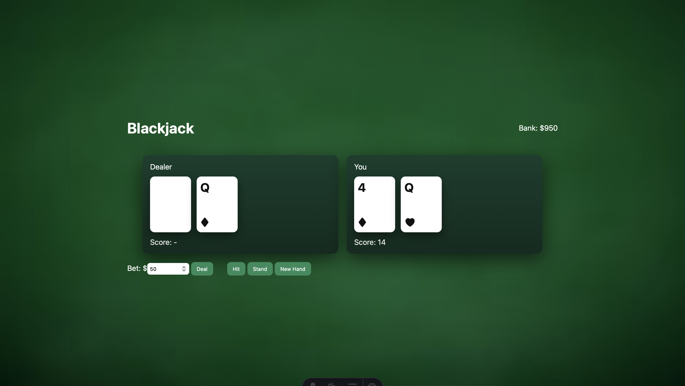

**Probleem:** bij twee azen klopte de waarde niet.
**Oplossing:** loop die assen terugzet van 11 naar 1 zolang de hand over 21 is.

```js
// server/gameManager.js
function handValue(hand) {
  let total = 0;
  let aceCount = 0;

  for (const card of hand) {
    if (card.rank === 'A') { aceCount++; total += 11; }
    else if (['J', 'Q', 'K'].includes(card.rank)) total += 10;
    else total += parseInt(card.rank, 10);
  }

  while (total > 21 && aceCount > 0) {
    total -= 10;
    aceCount--;
  }
  return total;
}
```

**09/04**
LocalStorage Web API toegevoegd zodat de spelstatus en het token bewaard blijven na een refresh. Hierdoor hoeft de gebruiker niet steeds opnieuw in te loggen.

```js
// token opslaan na inloggen
localStorage.setItem('session', token);

// bij elk paginabezoek uitlezen
const token = localStorage.getItem('session');
```

**Weeklijkse feedback**
Ik had hier de MVP gemaakt, maar de docent vond de layout slordig en moest hier op focussen voordat ik verder ging met complexere onderwerpen als de Mollie API en database. Verder miste ik nog de content API, maar wilde eigenlijk niet meer de kaarten-API gebruiken gezien ik zelf de kaarten al had gemaakt.

---

### Week 3

**15/04**
Best veel gedaan ondanks de Smashing Conference. Gewerkt aan de UI op basis van andere casino-websites. Het thema is uiteindelijk CMD geworden. Coins heb ik vervangen door EC-punten om in het thema te blijven. Een CMD-shop toegevoegd waar je EC-punten kunt omwisselen voor vakken om zo je diploma te halen.

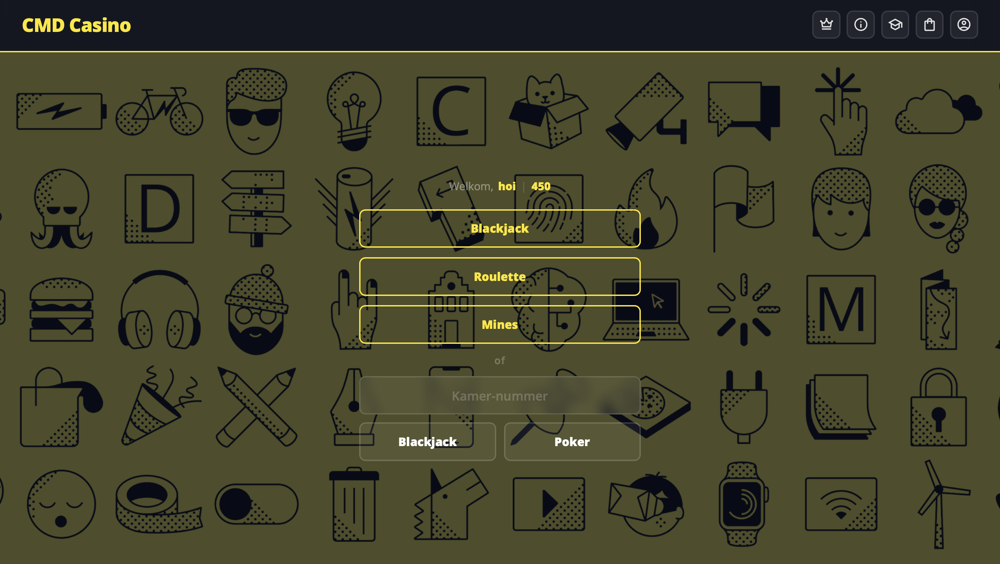

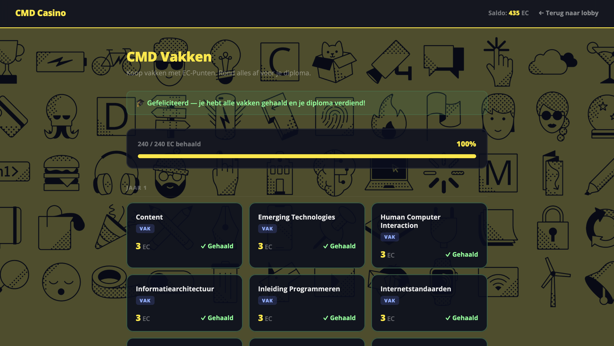

**16/04**
MongoDB toegevoegd voor accounts. Het probleem was dat de MongoDB-verbinding bij elke request opnieuw werd aangemaakt, wat heel traag was.

**Probleem:** nieuwe `MongoClient` per request → veel te traag.
**Oplossing:** singleton patroon — één verbinding voor de hele serverlevensduur.

```js
// server/mongodb.js
let database = null;

export async function getDB() {
  if (database) return database; // hergebruik bestaande verbinding

  const client = new MongoClient(process.env.MONGODB_URI);
  await client.connect();
  database = client.db('blackjack');

  await database.collection('users').createIndex({ username: 1 }, { unique: true });

  return database;
}
```

JWT-authenticatie toegevoegd zodat gebruikers ingelogd blijven. Het lastige was dat het token zowel via de `Authorization` header als via een cookie moest werken.

```js
// lib/auth.js
export function getTokenFromRequest(request) {
  const auth = request.headers.get('authorization');
  if (auth?.startsWith('Bearer ')) return auth.slice(7);

  const cookieHeader = request.headers.get('cookie') || '';
  const cookies = Object.fromEntries(
    cookieHeader.split(';').map(s => {
      const eq = s.trim().indexOf('=');
      return [s.slice(0, eq).trim(), s.slice(eq + 1).trim()];
    })
  );
  return cookies.session || null;
}
```

Doctor Who easter egg: accountnamen die "cyd" bevatten krijgen automatisch de Doctor Who profielfoto als avatar.


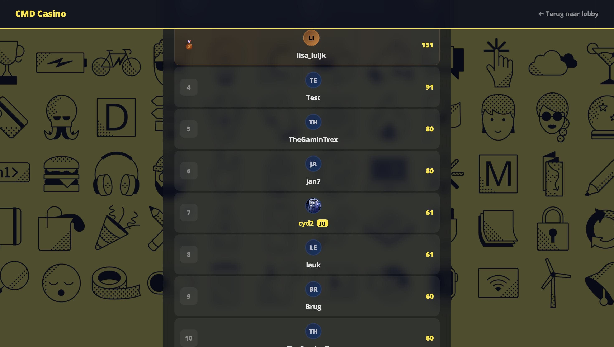

```js
// src/scripts/account.js
if (me.username.toLowerCase().includes('cyd')) {
  avatarEl.innerHTML = '';
}

// src/scripts/leaderboard.js
if (p.username.toLowerCase().includes('cyd')) {
  img.src = '/easter-egg.png';
}
```

**Weeklijkse feedback**
Geen feedback deze week — het was 'the web you want'.

---

### Week 4

**22/04**
Mollie API geïntegreerd voor betalingen (test-omgeving). Het lastigste was de webhook — Mollie stuurt een betaalstatus terug naar de server, maar lokaal is de server niet bereikbaar van buiten.

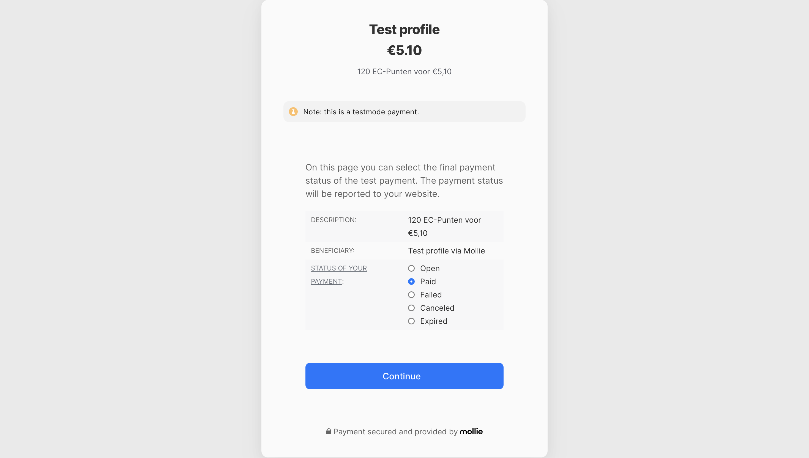

**Probleem:** webhookUrl instellen terwijl localhost niet bereikbaar is van buitenaf.
**Oplossing:** dynamisch de base-URL bepalen vanuit de request headers, en webhook overslaan op localhost.

```js
// src/pages/api/create-payment.js
const proto   = request.headers.get('x-forwarded-proto') || 'http';
const host    = request.headers.get('host');
const baseUrl = `${proto}://${host}`;
const isLocal = host.includes('localhost') || host.includes('127.0.0.1');

const payment = await mollie.payments.create({
  amount:      { currency: 'EUR', value: pkg.price },
  description: pkg.label,
  method:      'ideal',
  redirectUrl: `${baseUrl}/shop?payment=success`,
  ...(!isLocal && { webhookUrl: `${baseUrl}/api/webhook` }),
  metadata:    { packageId, userId: String(user._id) },
});
```

**23/04**
Leaderboard en de vakken-shop afgemaakt. WebSockets toegevoegd voor multiplayer blackjack. Het moeilijkste was de spelstatus synchroon houden tussen meerdere clients — als één speler een kaart trekt moet iedereen in de kamer dat direct zien.

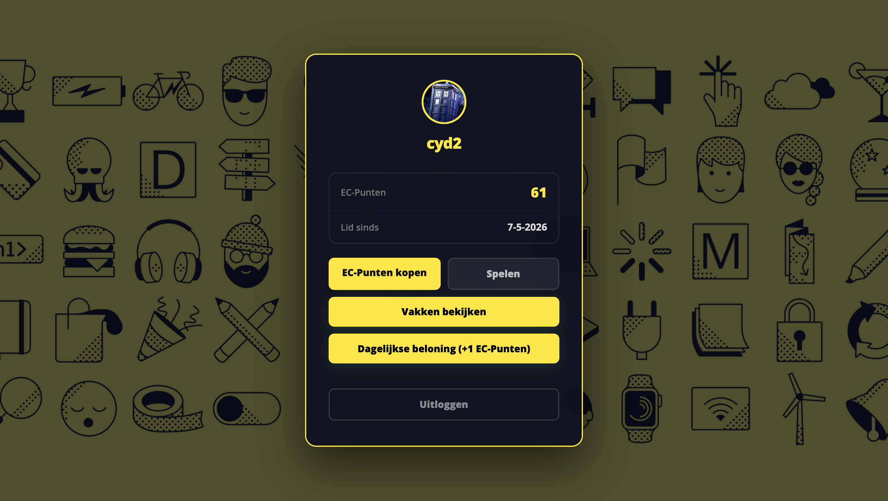

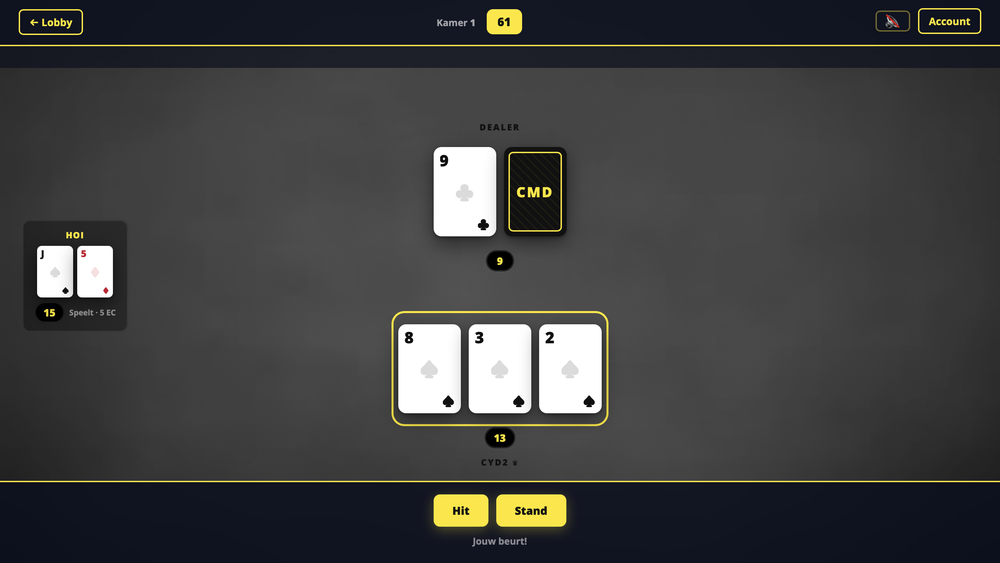

**Probleem:** spelstatus out-of-sync bij meerdere spelers.
**Oplossing:** rooms opslaan in een server-side `Map`, bij elke spelactie de volledige `ROOM_UPDATE` naar alle spelers in die room broadcasten.

```js
// server/gameManager.js
const rooms = new Map();

function broadcastRoom(roomId, wss) {
  const room = rooms.get(roomId);
  if (!room) return;
  const msg = JSON.stringify({ type: 'ROOM_UPDATE', room: sanitizeRoom(room) });
  for (const [ws, player] of room.players) {
    if (ws.readyState === ws.OPEN) ws.send(msg);
  }
}
```

**Weeklijkse feedback**
De docent vond het cool dat multiplayer blackjack werkte, ondanks ze niet erg van dit soort spellen is. Ze vond de easter egg met de Doctor Who ook leuk. De UI was veel beter, maar er waren twee kritiekpunten: de achtergrond tijdens het spelen was te afleidend en er miste nog steeds een content API. Ze suggereerde een sound API — maar dat bleek een web API te zijn, geen content API. Uiteindelijk heb ik een Wikipedia info-scherm gemaakt voor elk spel om dat op te lossen.

---

### Week 5

**29/04**
Roulette en Mines spellen toegevoegd. Bij Mines moest ik voorkomen dat de browser weet waar de mijnen liggen (anders zou je kunnen cheaten via de DevTools).

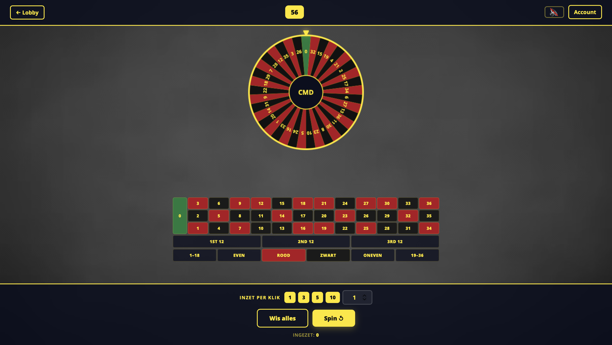

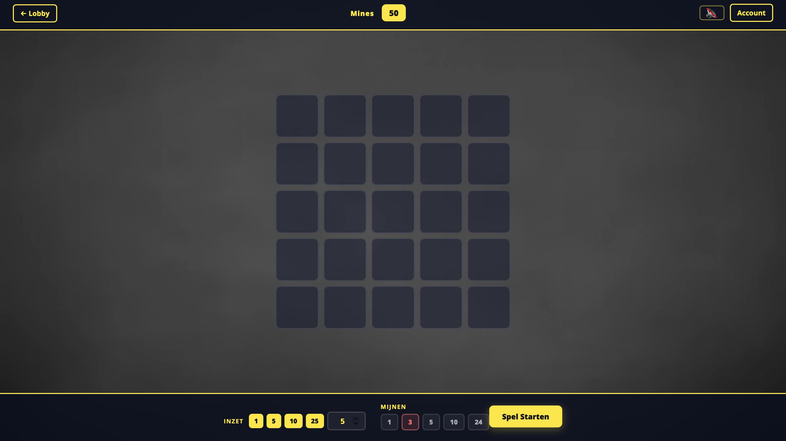

**Probleem:** mijnposities nooit naar de browser sturen, maar toch een spelstate bewaren.
**Oplossing:** posities server-side opslaan in een `Map` met een `gameId` als sleutel. Browser krijgt alleen de `gameId` terug.

```js
// server/minesState.js
const sessions = new Map();

export function createSession(userId, bet, mineCount, minePositions) {
  const id = Math.random().toString(36).slice(2, 12) + Date.now().toString(36);
  sessions.set(id, { userId, bet, mineCount, minePositions, revealed: new Set(), status: 'active' });

  // Automatisch opruimen na 15 minuten (verlaten spellen)
  setTimeout(() => sessions.delete(id), 15 * 60 * 1000);

  return id;
}

export function revealTile(id, index) {
  const session = sessions.get(id);
  if (session.minePositions.has(index)) {
    session.status = 'lost';
    return { mine: true };
  }
  session.revealed.add(index);
  return { mine: false };
}
```

**30/04**
Multiplayer Poker (Texas Hold'em) toegevoegd. De achtergrond van de spelschermen aangepast, die was te druk. ElevenLabs TTS geïntegreerd voor een live dealer stem en geluidseffecten.

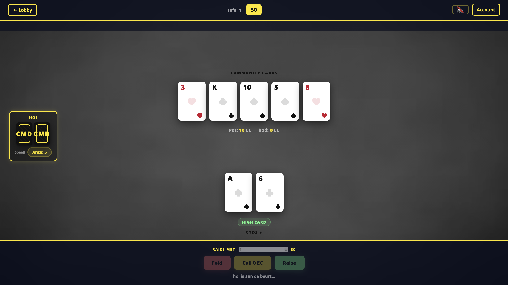

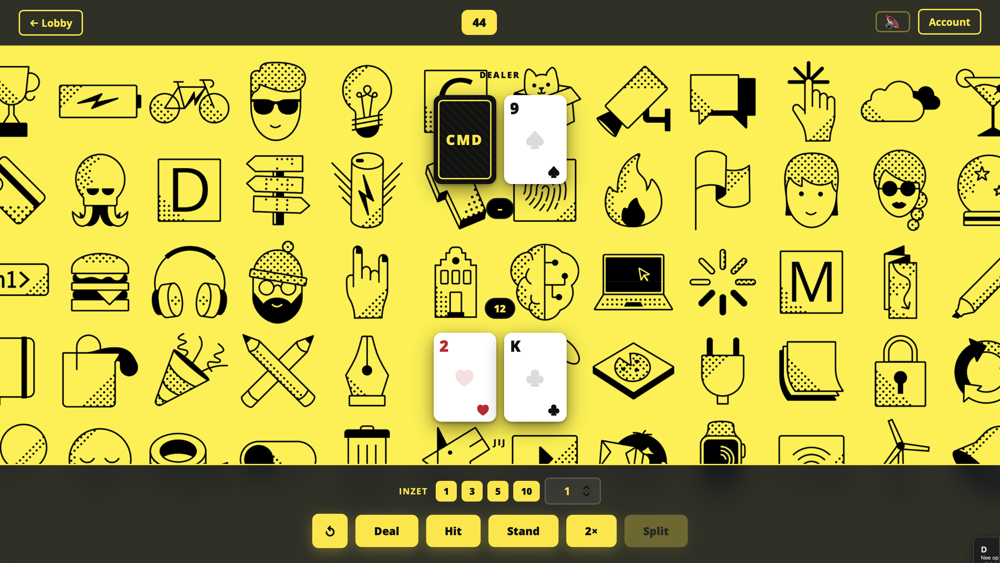

**Probleem:** ElevenLabs aanroepen bij elke dealeruitspraak was traag en verbruikte API-credits.
**Oplossing:** server-side in-memory cache — als dezelfde zin al eerder is uitgesproken, wordt het opgeslagen audio-fragment direct teruggegeven.

```js
// src/pages/api/tts.js
const cache = new Map();

export async function GET({ request }) {
  const text = new URL(request.url).searchParams.get('text');

  if (cache.has(text)) {
    return new Response(cache.get(text), {
      headers: { 'Content-Type': 'audio/mpeg', 'Cache-Control': 'public, max-age=86400' },
    });
  }

  const res = await fetch(`https://api.elevenlabs.io/v1/text-to-speech/${voiceId}`, {
    method: 'POST',
    headers: { 'xi-api-key': apiKey, 'Content-Type': 'application/json', 'Accept': 'audio/mpeg' },
    body: JSON.stringify({ text, model_id: 'eleven_multilingual_v2' }),
  });

  const audio = await res.arrayBuffer();
  cache.set(text, audio);
  return new Response(audio, { headers: { 'Content-Type': 'audio/mpeg' } });
}
```

Wikipedia (MediaWiki) content API toegevoegd op de Rules-pagina zodat spelers de spelregels kunnen lezen.

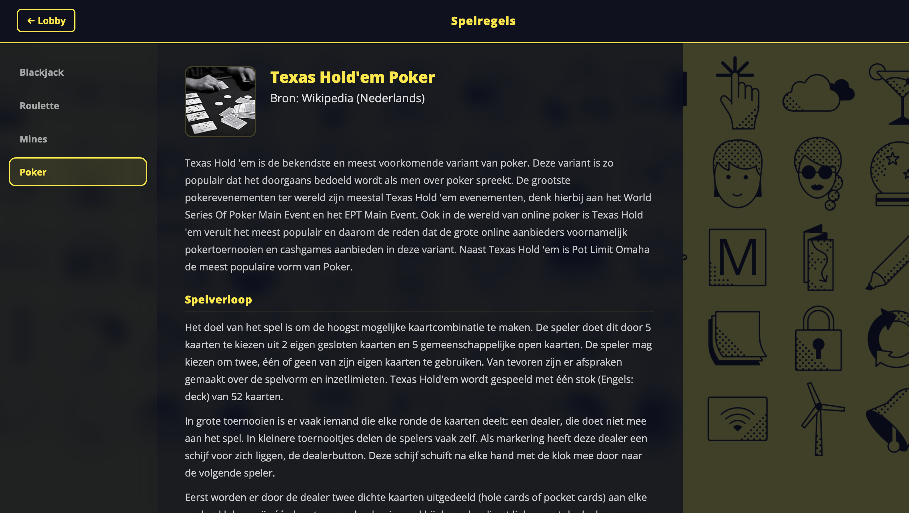

**Probleem:** Wikipedia-artikelen zijn groot en bevatten veel onnodige secties. Bovendien wilde ik Wikipedia niet bij elk paginabezoek aanroepen.
**Oplossing:** platte tekst ophalen, met regex splitsen op kopjes, en 1 uur cachen.

```js
// src/pages/api/rules.json.js
const cache = new Map();
const TTL_MS = 60 * 60 * 1000;

async function fetchWiki(wikiPage) {
  const cached = cache.get(wikiPage);
  if (cached && Date.now() < cached.expires) return cached.data;

  const params = new URLSearchParams({
    action: 'query', titles: wikiPage,
    prop: 'extracts|pageimages', explaintext: 'true',
    format: 'json', origin: '*',
  });

  const res  = await fetch(`https://nl.wikipedia.org/w/api.php?${params}`);
  const d    = await res.json();
  const page = Object.values(d.query.pages)[0];

  // Splits platte tekst op == Kopjes ==
  const sections = page.extract.split(/\n+(==+)\s*(.+?)\s*\1\n/);

  cache.set(wikiPage, { data: sections, expires: Date.now() + TTL_MS });
  return sections;
}
```
