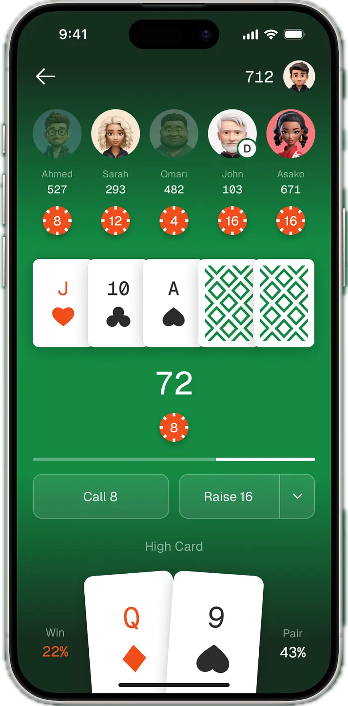

# Blackjack Platform

Een full-stack multiplayer blackjack applicatie gebouwd met Astro, Node.js en MongoDB. Spelers kunnen accounts aanmaken, coins verdienen, echte betalingen doen via Mollie en realtime tegen elkaar spelen.

---

## Features

- **Multiplayer blackjack** — realtime gameplay via WebSockets (max 4 spelers per tafel)
- **Authenticatie** — registreren, inloggen en sessies via JWT
- **EC systeem** — dagelijkse beloningen en EC-Punten kopen via Mollie-betalingen
- **Leaderboard** — ranglijst van spelers op basis van score
- **Shop** — EC-Punten kopen met iDEAL/andere betaalmethoden
- **Responsieve UI** — responsive CSS styling

---

## Tech Stack

| Laag | Technologie |
|------|------------|
| Frontend | [Astro](https://astro.build) (SSR) |
| Backend | Node.js + custom HTTP/WS server |
| Database | MongoDB |
| Realtime | WebSocket (`ws`) |
| Betalingen | [Mollie API](https://docs.mollie.com) |
| Auth | JWT + bcrypt |
| Provider | Render |

---

## Vereisten

- Node.js >= 22.12.0
- MongoDB instantie (lokaal of Atlas)
- Mollie API key (voor betalingen)

---

## Installatie

```bash
# Dependencies installeren
npm install

# Omgevingsvariabelen instellen
cp .env.example .env

# Development server starten
npm run dev

# Of de productieserver starten
npm start
```

---

## Omgevingsvariabelen

Maak een `.env` bestand aan in de root met de volgende variabelen:

```env
MONGODB_URI=mongodb://localhost:27017/blackjack
JWT_SECRET=jouw_geheime_sleutel
MOLLIE_API_KEY=test_xxxxxxxxxxxxxxxxxxxxxxxxxxxxxxxx
```

---

## Scripts

| Commando | Omschrijving |
|----------|-------------|
| `npm run dev` | Start de Astro dev server op `localhost:4321` |
| `npm run build` | Bouwt de productieversie naar `./dist/` |
| `npm run preview` | Preview van de gebouwde site |
| `npm start` | Start de Node.js productieserver (`server.mjs`) |

---

## Projectstructuur

```
/
├── public/               # Statische assets (CSS, client-side JS)
│   ├── client.js         # WebSocket client
│   ├── blackjack.js      # Blackjack spellogica (client)
│   └── shop.js           # Shop functionaliteit (client)
├── server/               # Server-side modules
│   ├── websocket.js      # WebSocket server & berichtenafhandeling
│   ├── gameManager.js    # Blackjack spellogica (server)
│   ├── db.js             # Database helperfuncties (coins, scores)
│   └── mongodb.js        # MongoDB verbinding
├── src/
│   └── pages/
│       ├── index.astro       # Lobby / startpagina
│       ├── blackjack.astro   # Spelscherm
│       ├── account.astro     # Accountoverzicht
│       ├── shop.astro        # Coin shop
│       ├── leaderboard.astro # Ranglijst
│       ├── login.astro       # Inloggen
│       ├── signup.astro      # Registreren
│       └── api/              # API endpoints
│           ├── auth/
│           ├── login.js
│           ├── signup.js
│           ├── score.json.js
│           ├── balance.json.js
│           ├── daily-reward.js
│           ├── create-payment.js
│           └── payment-webhook.json.js
├── lib/                  # Gedeelde serverlogica (auth, helpers)
├── server.mjs            # Entrypoint productieserver
└── astro.config.mjs      # Astro configuratie
```

---

## API Overzicht

| Methode | Endpoint | Omschrijving |
|---------|----------|-------------|
| POST | `/api/signup` | Nieuw account aanmaken |
| POST | `/api/login` | Inloggen, JWT ontvangen |
| GET | `/api/me` | Ingelogde gebruikersdata |
| GET | `/api/balance` | Huidige coin balance |
| GET | `/api/score.json` | Score opvragen |
| POST | `/api/daily-reward` | Dagelijkse beloning claimen |
| POST | `/api/create-payment` | Mollie betaling starten |
| POST | `/api/payment-webhook` | Mollie betaalstatus verwerken |
| GET | `/api/leaderboard.json` | Ranglijst opvragen |

---

## WebSocket Protocol

De WebSocket server draait op `/ws`. Berichten zijn JSON-objecten met een `type` veld.

**Client → Server**

| Type | Omschrijving |
|------|-------------|
| `PING` | Verbinding testen |
| `JOIN_TABLE` | Aan een tafel aanschuiven |
| `HIT` | Kaart trekken |
| `STAND` | Passen |
| `BET` | Inzet plaatsen |

**Server → Client**

| Type | Omschrijving |
|------|-------------|
| `WELCOME` | Verbinding bevestigd + client ID |
| `TABLE_LIST` | Lijst van beschikbare tafels |
| `GAME_STATE` | Volledige spelstatus |
| `CARD_DEALT` | Nieuwe kaart gedeeld |
| `ERROR` | Foutmelding |
| `PONG` | Ping-antwoord |

Design inspo:



Weekly nerd:
Johan Huijkman

Een screen reader die de hele pagina voor leest is heel frusterend. Het is bij toegankelijkheid belangrijk om de groep voor wie het is erbij te betrekken. Die vier hoekstukken van WCAG zijn Perceivable, Operable, Understandalbe and Robust. WCAG = Web Content Accessibility Guidelines. Stop niet bij alleen het volgen van de WCAG, maar in gesprek te gaan met de doelgroep met de beperking. Als de afbeelding geen toegvoegde waarde heeft, kan je het bestempelen als decoratief en kan hij leeg gelaten worden. Een schermlezer heeft al veel functies hebben en daar moet je rekening mee houden. Bijvoorbeeld met skip content dingen, hier moet je ook kijken of een schermlezer dat niet zelf al kan. Formulierregelaars, lijstjes zijn een functies van een screenreader om sneller bij je doel te komen. Cookies bovenaan is fijn, want die kan je dan gelijk weg klinken

Martijn
Wat maakt het voor hem/haar moeilijk?
Lange stukken tekst raakt hij moe of zijn concentratie kwijt. Header irritant dat die vergroot als je scrolt. Vervelend als er geen feedback is bijv bij een knop die niet interacteert met hover. 

Schaalbaarheid, contrast, gerelateerde informatie bij elkaar, visuele indicatoren zoals een focusrand.

Wat heeft hij/zij nodig?
Elementen die interacteren met bijv hover. 

Op welk moment denk dat hij/zij was afgehaakt in iets wat je hebt gemaakt?
Soms vallen dingen buiten het scherm als je erg inzoomt. 

Naduah mobiliteitsproblemen
Wat maakt het voor hem/haar moeilijk?
Velle kleuren dit triggerd kleuren, heel veel informatie door elkaar staat(vermoeiend en verminderd concetratie) of als ze heel lang moet zoeken

Wat heeft hij/zij nodig?
Dark/Light mode functie

Rustige layout en vormgeving, gevens moeten wroden opgeslagen

Op welk moment denk dat hij/zij was afgehaakt in iets wat je hebt gemaakt?
Als ze te lang moet zoeken

Guido 
Wat maakt het voor hem/haar moeilijk?
Snel overprikkeld, moet heel concreet zijn als hij iets moet doen, hij wil heel snel de informatie krijgen waar hij naar opzoek is.

Wat heeft hij/zij nodig?
Rusige layout, duidelijke instructies en meldingen en voorspelbaarheid

Op welk moment denk dat hij/zij was afgehaakt in iets wat je hebt gemaakt?

TODO:
* Mollie API Payment system
* LocalStorage API
* MongoDB Database
* Leaderboard
* Websockets API Multiplayer
* (Optional) Poker

Feedback
* Geluid toevoegen, content api[]
* Layout netter maken letten op focus op ruimte [X]
* Multiplayer[] toevoegen wel belangrijk nog om voor de webAPI en localStorage niet vergeten[X]
* Focus eerst op het mooi maken daarna op de extra features zoals de database en payment system.[X]
* Poker laten zitten
* Niet te ingewikkeld maken

* Dubbel en split toevoegen [x]
* Leaderbord fixen
* Database werkend krijgen online
* Multiplayer (websockets werkend krijgen)
* Studiepunten ipv coins is leuker voor een CMD casino [x]
* Refactor file structure
* CMD style toepassen[x]
* Easter Egg / als cyd account met profiel foto van cyd